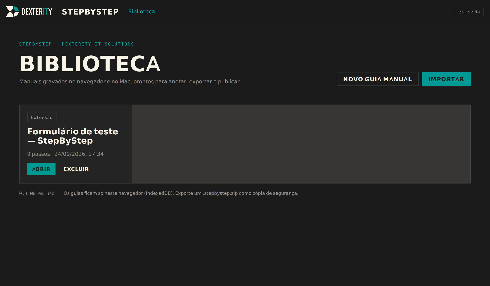
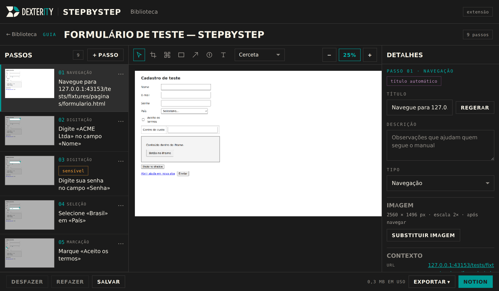
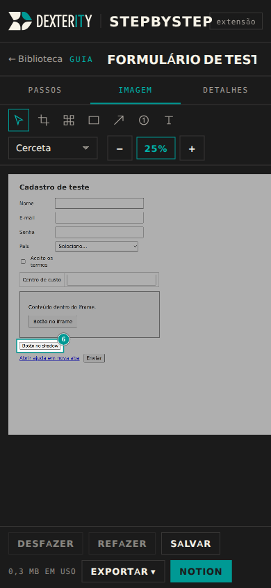
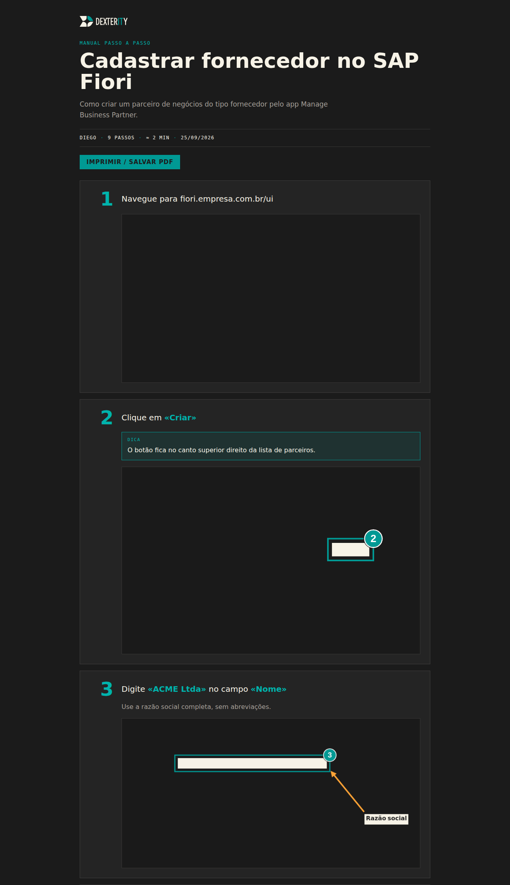
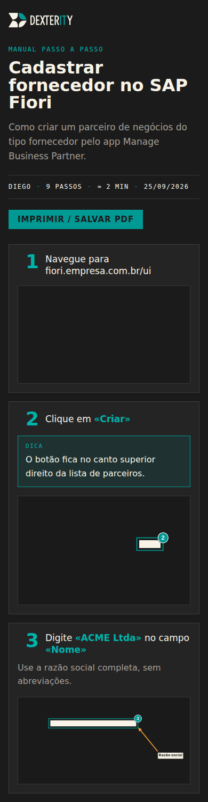
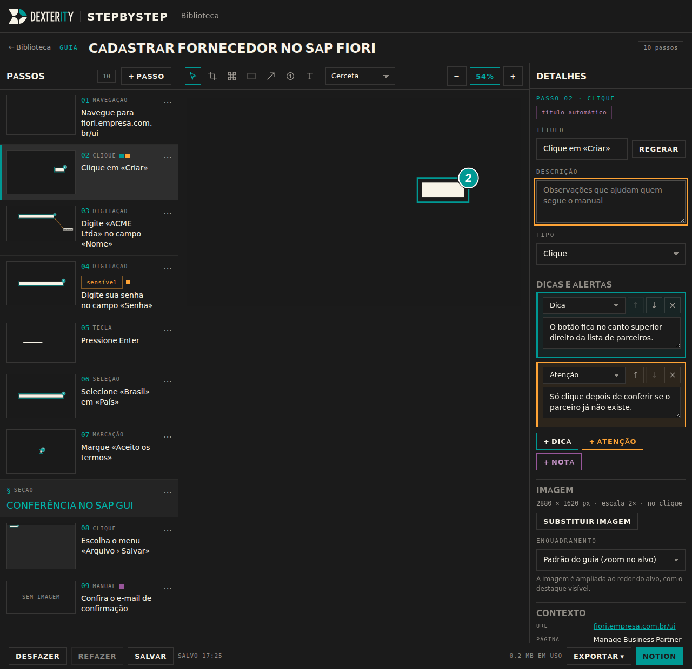

# StepByStep

Manuais passo a passo capturados automaticamente — no navegador (extensão Chrome) e no Mac (app de menu bar) —
com anotações polidas em português, editor de imagens e publicação no Notion. Dexterity IT Solutions.

**Editor em produção:** https://stepbystep-dexterity.vercel.app (Vercel, time `dexterityit`, projeto
`stepbystep-dexterity`; cada push na `main` publica em produção).

Arquitetura e contrato entre os pacotes: [`docs/especificacao.md`](docs/especificacao.md).
Guia do Notion para o usuário: [`docs/notion.md`](docs/notion.md).

## Visão geral

Você aperta **Gravar**, executa o processo (no SAP Fiori, no SAP GUI, num sistema web qualquer ou num app do
Mac) e o StepByStep registra cada clique, digitação, seleção e tecla com uma captura de tela, gera frases em
pt-BR ("Clique em «Criar»", "Digite «ACME Ltda» no campo «Nome»") e marca o alvo na imagem. Depois você ajusta
tudo no **editor** (reordenar, mesclar, recortar, desfocar dados sensíveis, setas, textos) e exporta para
**Markdown + imagens** (zip), **HTML autocontido**, **PDF** (impressão) ou publica como página nova no **Notion**.

| Peça | Onde | O que faz |
|---|---|---|
| Núcleo | `packages/core/` | Formato do guia (JSON v1), frases, coordenadas, redutor de eventos, anotações, render, exportadores, cliente do Notion, IndexedDB. ES modules puros (rodam em Node, no service worker e na página). |
| Extensão Chrome MV3 | `packages/extensao/` | Captura no navegador: barra flutuante, sensor de eventos, service worker, popup. Carrega `core/` e `editor/` copiados por `npm run sincronizar`. |
| Editor web | `packages/editor/` | Biblioteca de guias e editor (sem build). Hospedado em <https://stepbystep-dexterity.vercel.app/editor/> e embutido na extensão. |
| App Mac | `packages/mac/` | Menu bar em Swift (macOS 14+): captura o display inteiro, lê Acessibilidade/OCR e grava uma pasta que o editor importa. |
| API | `api/` | `notion.js` (proxy allow-list para a API do Notion, usado só pelo editor hospedado) e `hash.js` (integridade da publicação). |

Um único formato de guia (`guide.json` v1 + PNGs originais) atravessa tudo: extensão, Mac, inserção manual e
editor. Todas as coordenadas são em pixels da imagem original; anotações são não destrutivas (o original é
preservado; a exportação "assa" um novo PNG). Valor de campo sensível (senha, cartão, CPF…) nunca sai da página
gravada e a imagem recebe pixelização irreversível.

## Requisitos

- Node 22+ (`npm ci` instala só o Playwright, usado nos testes e2e).
- Chrome 116+ para a extensão.
- Para o app Mac: macOS 14+ e Command Line Tools (Swift 5.9+) — `xcode-select --install`.

## Instalar a extensão (carregar sem compactação)

A extensão é distribuída internamente, sem loja: a pasta `packages/extensao/` é carregável direto no Chrome
depois de receber as cópias de `core/` e `editor/`.

```bash
npm ci
npm run sincronizar      # copia packages/core → packages/extensao/core e packages/editor → packages/extensao/editor
```

1. Abra `chrome://extensions`, ligue o **Modo do desenvolvedor** (canto superior direito).
2. Clique em **Carregar sem compactação** e escolha a pasta `packages/extensao/`.
3. Fixe o ícone do StepByStep na barra. Atalho para iniciar/parar a gravação: **Alt+Shift+R**
   (configurável em `chrome://extensions/shortcuts`).

Para distribuir um zip: `npm run empacotar` gera `dist/stepbystep-extensao-<versão>.zip`; quem recebe
descompacta e faz o mesmo "Carregar sem compactação" (ou o zip entra numa política de empresa).

Por que a extensão pede `<all_urls>`: a gravação atravessa domínios (SSO → sistema) e `activeTab` expira ao
navegar. Nada é injetado fora de uma gravação: os content scripts são registrados só quando você aperta
Gravar e removidos ao parar.

### Gravar no navegador

1. Na aba do processo, clique no ícone › **Iniciar gravação** (ou Alt+Shift+R). Aparece a barra flutuante
   "Gravando · n passos" e o badge do ícone fica cerceta.
2. Execute o processo normalmente. Cliques, digitação (confirmada ao sair do campo/Enter), seleções, marcações,
   Enter e atalhos viram passos; navegações viram "Navegue para …". O botão **+** da barra (Passo manual)
   insere um passo de texto.
3. **Pausar** ignora eventos (badge âmbar); **Parar** encerra e abre o guia no editor.

Páginas `chrome://`, a Chrome Web Store e PDFs não podem ser gravados — use o popup e passos manuais.

## Build do app Mac

```bash
cd packages/mac
make build                  # swift build -c release
make test                   # swift test (GuiaTests, CoordenadasTests, TeclasTests, PastaGravacaoTests) — exige o Xcode
make app                    # monta build/StepByStep.app e assina com o certificado "StepByStep Dev"
open build/StepByStep.app   # sempre pelo Finder/open — rodar o binário no Terminal dá as permissões ao Terminal
```

`make build` e `make app` bastam com os Command Line Tools; `make test` precisa do Xcode instalado (o XCTest não
vem no CLT). Os scripts rodam com `bash` + `pipefail`, então um erro do `swift build` não passa despercebido.

Na primeira execução conceda **Acessibilidade** e **Gravação de Tela** (Ajustes › Privacidade e Segurança) e
reabra o app. O certificado autoassinado estável (Acesso às Chaves › Assistente de Certificado › Criar
certificado › tipo "Assinatura de código", nome `StepByStep Dev`) faz o macOS lembrar as permissões entre
builds. Detalhes, permissões e roteiro de teste manual: `packages/mac/README.md`.

O app grava em `~/Documents/StepByStep/<data>_<app>/` (`guide.json` + `imagens/*.png` + `eventos.ndjson`) e,
ao parar, gera `<pasta>.stepbystep.zip` e abre o editor em `#/importar`. O Mac não gera frases: grava
`titulo: ""` e o editor as gera na importação.

## Uso do editor

Hospedado: <https://stepbystep-dexterity.vercel.app/editor/>. Na extensão: ícone › **Abrir editor**.

- **Biblioteca** (`#/`): guias salvos neste navegador (IndexedDB), Abrir, Excluir, **Novo guia manual**,
  **Importar** (`.json`, `.zip`/`.stepbystep.zip` ou a pasta gravada pelo Mac — também por arrastar e soltar).
  Guias com gravação interrompida aparecem com um banner âmbar.
- **Editor** (`#/guia/<id>`): título editável; à esquerda a lista de passos (arrastar ou Alt+↑/↓ para
  reordenar, editar, excluir, inserir passo manual ou seção, duplicar, mesclar com o anterior, regerar título);
  no centro a imagem com as ferramentas **Selecionar (V)**, **Recorte (C)** (com "Focar no alvo" e "Recortar à
  janela"), **Desfoque (B)**, **Retângulo (R)**, **Seta (A)**, **Marcador (M)**, **Texto (T)**; à direita o
  painel do passo (título, descrição, tipo, **dicas e alertas**, enquadramento da imagem, metadados, anotações,
  estilo do guia).
- **Zoom no alvo** (padrão): a imagem exportada é ampliada ao redor do elemento clicado, com o destaque e o
  marcador visíveis, sem alterar a captura. Por passo dá para escolher «Tela inteira» (ou mudar o padrão do guia);
  um recorte manual sempre manda. Vale também para guias antigos.
- **Dicas e alertas**: caixas de *Dica* (cerceta), *Atenção* (âmbar) e *Nota* (roxo) por passo, com um indicador
  colorido no cartão da lista.
- Desfazer/Refazer: Ctrl/⌘+Z, Ctrl/⌘+Shift+Z. Salvamento automático. A 390 px as colunas viram abas.

Os guias ficam no navegador; nada sai da máquina sem uma exportação ou publicação explícita.

### Capturas

Editor empacotado na extensão (`chrome-extension://…/editor/index.html`) logo depois de **Parar** uma gravação
da página de teste `tests/fixtures/paginas/formulario.html`:

| Biblioteca | Editor (1280 px) | Editor a 390 px |
|---|---|---|
|  |  |  |

Guia exportado (HTML, fixture `guia-exemplo`) e o painel de dicas/enquadramento do editor:

| HTML exportado (1280 px) | HTML exportado a 390 px | Dicas e enquadramento |
|---|---|---|
|  |  |  |

## Exportações

Todas as exportações seguem o mesmo roteiro de workflow: cabeçalho com **autor · nº de passos · tempo estimado ·
data**, uma frase curta por passo com o alvo em negrito, as caixas de dica/atenção/nota e a imagem **ampliada no
alvo** (área efetiva: recorte manual › zoom no alvo › tela inteira).

| Formato | Conteúdo |
|---|---|
| `.stepbystep.zip` | Intercâmbio/backup: `guide.json` + PNGs **originais** (sem anotações). Reimportável no editor. |
| Markdown + imagens (zip) | `README.md` com `# Título`, linha de metadados, `## n. Passo`, notas em citação (`> **Dica:** …`) e ``; imagens **assadas** com as anotações (opção "reduzir a 1x"). Cola direto em wiki, Git ou Confluence. |
| HTML autocontido | Um arquivo com CSS Dexterity inline e imagens em `data:` — um cartão por passo (número grande em cerceta, caixas coloridas, imagem com fio de 1 px); abre em qualquer navegador, sem rede, e se ajusta a 390 px. |
| Imprimir / salvar PDF | Abre o HTML e chama a impressão (A4, margem 15 mm, fundo branco; um cartão nunca quebra no meio da página). |
| Notion | Página nova na página-mãe escolhida: callout 📘 com o resumo, `heading_3` "n. título" por passo, um callout por nota (💡 verde, ⚠️ laranja, 📝 roxo) e a imagem hospedada no Notion. |

## Notion

Fluxo do usuário em [`docs/notion.md`](docs/notion.md): criar uma **integração interna** em
notion.so/profile/integrations com as capacidades **Ler conteúdo** e **Inserir conteúdo**, **conectar** a
integração à página-mãe (··· › Conexões — o passo mais esquecido) e colar o token no editor (**Testar** →
escolher a página-mãe → **Publicar**).

Como funciona por baixo: File Upload API (`POST /v1/file_uploads` + `/send` multipart), `POST /v1/pages` com o
primeiro lote de blocos e `PATCH /v1/blocks/{id}/children` para os demais (≤ 100 blocos de topo / ≤ 1000 por
requisição, `rich_text` ≤ 2000 caracteres), `Notion-Version: 2022-06-28` fixa, publicação retomável.

- Na **extensão** o editor chama `https://api.notion.com` direto (`host_permissions`).
- No editor **hospedado** o navegador não pode chamar a API do Notion (CORS), então as chamadas passam por
  `api/notion.js` (assinatura Web, exportada só como `GET`/`POST`/`PATCH`/`OPTIONS` — com um
  `export default` o builder da Vercel trataria o handler como `(req, res)` do Node): allow-list de rotas e
  métodos, corpo repassado byte a byte (multipart intacto),
  só `authorization`, `notion-version` e `content-type` seguem adiante, CORS restrito às origens do editor,
  `Cache-Control: no-store`, nenhum log de cabeçalhos e nenhum segredo no servidor. Variáveis:
  `NOTION_BASE` (só testes; aponta para o Notion falso) e `ORIGENS_PERMITIDAS` (lista separada por vírgula;
  previews `https://stepbystep-*.vercel.app` são aceitos automaticamente). Atrás do proxy o corpo é limitado a
  4,5 MB pela Vercel — o editor reduz imagens acima de 4 MB.

O token fica no IndexedDB do usuário (botão **Esquecer token** apaga); nunca vai para o guia, para o código nem
para o servidor.

## Testes

```bash
npm test            # node --test: núcleo, estado da extensão, API (proxy, Notion falso, dev-server) e sincronização — sem navegador
npm run test:e2e    # Playwright 1.56 (Chromium): grava formulario.html com a extensão; importa/edita/exporta/publica no editor
npm run sincronizar # necessário antes do e2e e para tests/sincronizacao.test.mjs não ser pulado
```

- `tests/core/`: módulos do núcleo (frases a partir de `tests/fixtures/frases.json`, redutor com timestamps,
  render com `ctx` falso, zip/pacote round-trip, blocos e cliente do Notion com `fetch` injetado…).
- `tests/api/`: o proxy chamado como handler Web contra o **Notion falso** (`scripts/notion-falso.mjs` —
  implementa as rotas usadas, exige token e versão, valida limites, simula `429` e upload expirado, registra
  cada requisição), o dev-server (rewrites, `/api/hash`, `/api/notion`) e uma publicação completa do guia de
  exemplo com o cliente real.
- `tests/sincronizacao.test.mjs`: `packages/extensao/{core,editor}` idênticos byte a byte aos originais
  (pulado com "rode `npm run sincronizar`" enquanto as cópias não existem).
- `tests/e2e/`: Playwright com `launchPersistentContext` + `channel: 'chromium'` + `--load-extension`
  (Chromium em `/opt/pw-browsers` via `PLAYWRIGHT_BROWSERS_PATH`, ou `npx playwright install chromium`).
  Cada arquivo sobe `scripts/dev-server.mjs` numa porta livre com `NOTION_BASE` apontando para o Notion falso.
- `swift test` só roda no Mac (e no job `macos-latest` do CI).

Servidor local com os mesmos redirects e rewrites da Vercel (`/` e `/editor` → `/editor/`, `/editor/*` → `packages/editor/*`,
`/core/*` → `packages/core/*`, mais `/tests/*` e `/packages/*`) e as funções `/api`:

```bash
npm run dev                                          # http://localhost:8080/editor/  (PORT para trocar)
node scripts/notion-falso.mjs                        # Notion falso em :8090 (PORT para trocar)
NOTION_BASE=http://127.0.0.1:8090 npm run dev        # editor local publicando no Notion falso
```

## Publicação

- **Editor + API**: Vercel, time `dexterityit`, projeto `stepbystep-dexterity`, vinculado ao repositório —
  push na branch padrão = produção em <https://stepbystep-dexterity.vercel.app> (`/` e `/editor` redirecionam
  para `/editor/`). `vercel.json` fixa região `gru1`, rewrites `/editor/*` e `/core/*`, `maxDuration: 60` para
  `api/**` e cache de 5 min nos estáticos. `.vercelignore` deixa de fora extensão, Mac, testes, scripts e docs.
- **Verificação**: o workflow **Verificar publicação** (`.github/workflows/verificar-publicacao.yml`) roda a
  cada deploy de produção (e manualmente) e compara o `sha256sum` de `packages/editor/app.js`,
  `packages/core/modelo.js` e outros arquivos com o que `GET /api/hash?path=/editor/app.js` (e `/core/...`)
  devolve do site, além de conferir o preflight e a allow-list de `/api/notion`.
- **Testes no CI**: **Testes** (`.github/workflows/testes.yml`) — job Ubuntu (`npm ci`, Chromium do
  Playwright, `npm run sincronizar`, `npm test`, `npm run test:e2e` em headless novo) e job
  `macos-latest` (`swift build -c release` e `swift test` em `packages/mac`), que é o único guarda-corpo real
  do código Swift escrito fora do Mac.
- **Extensão**: zip gerado por `npm run empacotar`, distribuído internamente ("carregar sem compactação").
- **App Mac**: compilado no Mac do usuário (`packages/mac/README.md`).

## Estrutura

```
packages/core/          núcleo — ES modules puros (modelo, frases, coordenadas, redutor, anotações, render, exportadores, zip, notion, IndexedDB)
packages/editor/        editor web sem build (index.html, app.js, módulos, dexterity.css idêntico aos demais apps Dexterity)
packages/extensao/      extensão Chrome MV3 (manifest, sw.js, conteúdo, popup; core/ e editor/ gerados por `npm run sincronizar`)
packages/mac/           app de menu bar em Swift (SwiftPM, macOS 14+)
api/notion.js           proxy allow-list para api.notion.com (assinatura Web; só o editor hospedado)
api/hash.js             integridade: tamanho e SHA-256 de um arquivo publicado (/editor/* ou /core/*)
scripts/                dev-server, notion-falso, sincronizar-extensao, empacotar-extensao, gerar-fixtures
tests/                  core/, extensao/, api/, e2e/, fixtures/ e sincronizacao.test.mjs
docs/                   especificacao.md (contrato) e notion.md (guia do usuário)
```
